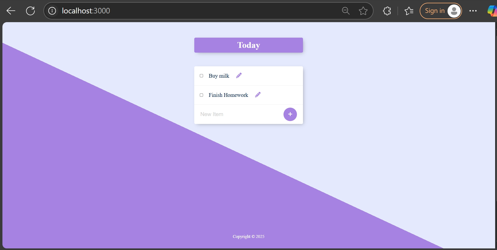

# permalist-project

<h1 align="center">📝 Permalist</h1>

<p align="center">
  A persistent and minimalist to-do list web app built using <strong>Node.js</strong>, <strong>Express</strong>, and <strong>PostgreSQL</strong>.
</p>

<p align="center">
  
  
  
  
</p>

---

## ✨ Overview

**Permalist** is a dynamic to-do list application with a clean UI and full CRUD operations. Tasks are stored persistently in a PostgreSQL database, ensuring your data is never lost.

---

## 🚀 Features

- ✅ Add new tasks
- 📝 Edit existing tasks
- ❌ Delete tasks
- 💾 PostgreSQL-backed persistent storage
- 🎨 Clean UI with EJS templating

---

## 📦 Tech Stack

| Category       | Tech                         |
|----------------|------------------------------|
| Backend        | Node.js, Express             |
| Database       | PostgreSQL                   |
| Templating     | EJS                          |
| Middleware     | body-parser                  |
| Frontend       | HTML, CSS (served from `/public`) |

---

## 📁 Folder Structure

```

permalist/
├── public/             # Static files (CSS, JS)
├── views/
│   └── index.ejs       # Main frontend template
├── app.js              # Main application logic
├── package.json        # Project metadata & scripts
└── README.md

````

---

## 🛠️ Setup Instructions

### 1️⃣ Clone the repository

```
git clone https://github.com/Yogeshwari1703/permalist-project.git
cd permalist
````

### 2️⃣ Install dependencies

```
npm install
```

### 3️⃣ Set up the PostgreSQL database

Make sure PostgreSQL is running on your machine.

```
CREATE DATABASE world;

\c world

CREATE TABLE items (
  id SERIAL PRIMARY KEY,
  title TEXT NOT NULL
);
```

### 4️⃣ Configure database credentials

Update this section in `app.js` with your local PostgreSQL credentials:

```
const db = new pg.Client({
  user: "your_username",
  host: "localhost",
  database: "world",
  password: "your_password",
  port: 5432,
});
```

### 5️⃣ Run the app

```
node app.js
```

Open your browser and visit: **[http://localhost:3000](http://localhost:3000)**

---

## 📸 Screenshots


| 📱 Main Page                                                                         |
| ------------------------------------------------------------------------------------ |
|  |

---

## 🌟 Roadmap / Future Enhancements

* 🧑‍💻 User Authentication
* 🗂️ Multiple Lists (e.g., Work, Personal)
* ⏰ Due Dates and Reminders
* 🔃 Drag & Drop Task Reordering
* 📱 Mobile Responsive Design

---

## 🧑‍🎓 Author

**Yogeshwari**
🔗 [GitHub](https://github.com/Yogeshwari1703)
📬 [Linkedin](https://www.linkedin.com/in/yogeshwarisakharwade)

---
